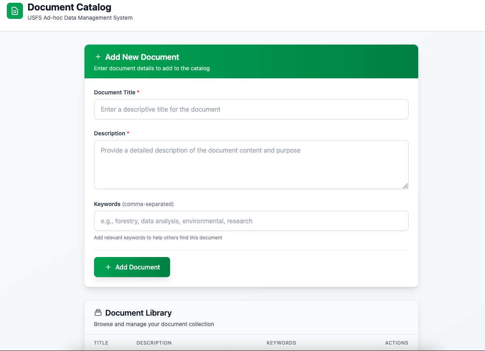

# Ad-Hoc Data Catalog



The figure shows a high-level overview of the ad-hoc catalog system, The application is running locally on a Windows workstation.

AdHoc catalog is an option for an individual or small group of people to start a data catalog that can be incorporated into an enterprise level catalog once a catalog system is chosen and implemented.  Most tools (e.g., python) used to create the ad-hoc catalog project are accessible via the USDA Software Center.

Since the USDA/USFS metadata working group has not determined a metadata standard three fields were selected that span multiple metadata standards.  The three fields are title, description, and keywords.  The project is flexible enough to allow for the addition of other fields when needed.  The application is a simple web based application that allows a user to create a document, edit an existing document and delete a document.  Because the backend database is a sqlite3 file, the data in the database can be imported into an enterprise data catalog system.

## Tools

* python 3.12 – provided by USDA Software Center
* sqlite3 - provided by USDA Software Center
* html and javascript

<!-- ## Methods
Create project folder (adhoc)  

Create python virtual environment in project folder  
    python -m venv venv  

Activated python virtual environment in project folder  
    venv/Scripts/activate.ps1  

Installed the python uv package manager  
    pip install uv  

Initialized a python uv project  
uv new . --package  

Created objects used to store a metadata in the backend database.  

Document object:  

    id: integer, unique primary key

    title: string, document title

    description: string, document description

    keywords: list, array or list of strings

Keyword object:

    id: integer, unique primary key

    name: string, the keyword

    documents: list, array or list of documents associated with the keyword

KeywordLink object:

This is a many-to-many table that maps document objects to keywords and keywords to document objects.

Python libraries:

    fastapi – serves the web interface

    jinja2 – html templating

    pydantic – data modelling

    sqlmodel – sql library for working with python data models and supporting database

The project work is stored in a github repository.  Code and documentation on the proof-of-concept work can be found in the src/catalog/adhoc folder.
```
```

This adds a brief description of what's shown in the image, making it easier to understand the diagram for readers who may not have seen it before.<!-- filepath: /Users/acatejr/Documents/workspace/github.com/acatejr/catalog/docs/ad-hoc-catalog.md -->
<!-- # Ad-Hoc Data Catalog


The figure shows a high-level overview of the ad-hoc catalog system, including its components and relationships.

AdHoc catalog is an option for an individual or small group of people to start a data catalog that can be incorporated into an enterprise level catalog after a catalog system is chosen and implemented.  Most tools (e.g., python) used to create the project were already accessible via the USDA Software Center.

Since the USDA/USFS metadata working group has not determined a metadata standard three fields were selected, that span multiple metadata standards, to make progress on this proof-of-concept project.  The three fields are title, description, and keywords.  The project is flexible enough to allow for the addition of other fields if needed in the future.  The application is a simple web based application that allows a user to create a document, edit an existing document  and delete a document.  Because the backend database is a sqlite3 file, the data in the database can be easily imported into an enterprise data catalog system when ready.

Tools and Methodology

Python 3.12 – provided by USDA Software Center

Create project folder (adhoc)

Create python virtual environment in project folder

    python -m venv venv

Activated python virtual environment in project folder

    venv/Scripts/activate.ps1

Installed the python uv package manager

    pip install uv

Using sqlite3 as the backend database.  Sqlite3 is accessible through the USDA Software Center

Initialized a python uv project

    uv new . --package

Created objects used to store a metadata in the backend database. 

Document object:

    id: integer, unique primary key

    title: string, document title

    description: string, document description

    keywords: list, array or list of strings

Keyword object:

    id: integer, unique primary key

    name: string, the keyword

    documents: list, array or list of documents associated with the keyword

KeywordLink object:

This is a many-to-many table that maps document objects to keywords and keywords to document objects.

Python libraries:

    fastapi – serves the web interface

    jinja2 – html templating

    pydantic – data modelling

    sqlmodel – sql library for working with python data models and supporting database

The project work is stored in a github repository.  Code and documentation on the proof-of-concept work can be found in the src/catalog/adhoc folder.
```
```

This adds a brief description of what's shown in the image, making it easier to understand the diagram for readers who may not have seen it before. -->