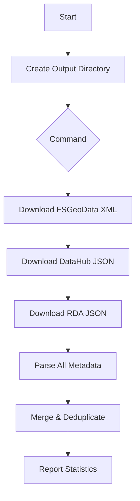

# Data Harvesting

Metadata needs to be harvested in order to construct the supporting database and vector database table.  The metadata have been harvested from the three sources referenced in the [metadata sources page](/metadata-sources).  For proof-of-concept the metadata from the sources are collected and a subset of the fields in each source's records were stored as a collection of json documents in one json file. The fields used in each document object are:  

```
    id: string
    title: string
    description: string 
    keywords: string list of keywords
    src: string describing where the document record orginated (fsgeodata, rda, datahub)
```

## Overview

The `cli.py` module provides a command-line interface for managing USFS (United States Forest Service) metadata catalog operations. It handles downloading, parsing, and storing metadata from multiple USFS data sources, including FSGeoData, DataHub, and RDA (Research Data Archive).

## Table of Contents

- [Commands Reference](#commands-reference)
- [Internal Functions](#internal-functions)
- [Data Sources](#data-sources)
- [Data Flow](#data-flow)
- [Usage Examples](#usage-examples)

### Dependencies

The CLI requires the following Python packages:

```python
typer                    # CLI framework
python-dotenv           # Environment variable management
requests                # HTTP requests
beautifulsoup4          # HTML/XML parsing
sentence-transformers   # Text embeddings
langchain-text-splitters # Text chunking
```

### Directory Structure

The CLI creates and uses the following directory structure for storing temporary files and output files:

```
data/
└── catalog/          # Default output directory (DEST_OUTPUT_DIR)
```

## Commands Reference

### `download-all`

Downloads metadata from all configured sources (FSGeoData, DataHub, and RDA).

```bash
PYTHONPATH=src python src/cli.py download-all
```

**What it does:**
1. Downloads metadata from FSGeoData (XML files)
2. Downloads metadata from DataHub (JSON)
3. Downloads metadata from RDA (JSON)

**Output:**
- Downloaded files stored in `data/catalog/`
- Console output showing progress

### `embed-and-store`

Embeds all downloaded and parsed metadata and stores it in the vector database.

```bash
PYTHONPATH=src python src/cli.py embed-and-store
```

**What it does:**
1. Parses all downloaded metadata
2. Combines title, description, keywords, and source into searchable text
3. Splits text into manageable chunks
4. Generates vector embeddings for each chunk
5. Stores chunks with embeddings in PostgreSQL

**Processing details:**
- Uses `all-MiniLM-L6-v2` model for embeddings
- 65-character chunks with no overlap
- Maintains metadata for each chunk including:
  - Document ID
  - Chunk type and index
  - Original title and description
  - Keywords and source

### `clear-docs-table`

Clears all records from the documents table.

```bash
PYTHONPATH=src python src/cli.py clear-docs-table
```

### `run-api`

Starts the FastAPI server.

```bash
PYTHONPATH=src python src/cli.py run-api
```

### Utility Functions

#### `create_output_dir()`
Creates the output directory (`tmp/catalog`) if it doesn't exist.

#### `hash_string(s: str) -> str`
Generates a SHA-256 hash of the input string. Used to create unique document IDs.

```python
# Example
doc_id = hash_string("forest inventory analysis")
```

#### `strip_html_tags(text: str) -> str`
Removes HTML tags from text and replaces newlines with spaces.

```python
# Example
clean_text = strip_html_tags("<p>Forest <b>data</b></p>")
# Returns: "Forest data"
```

#### `get_keywords(item: dict) -> list`
Extracts and cleans keywords from metadata items.

```python
# Example
keywords = get_keywords({"keywords": "forest, inventory, analysis"})
# Returns: ["forest", "inventory", "analysis"]
```

#### `merge_docs(*docs: List[Dict]) -> List[Dict]`
Merges multiple document lists, removing duplicates based on document ID.

```python
# Example
unique_docs = merge_docs(fsgeodata_docs, datahub_docs, rda_docs)
```

#### `find_duplicate_documents(documents: list) -> list`
Identifies duplicate documents in a list based on their IDs.

#### FSGeoData Functions

##### `_download_fsgeodata_metadata()`
- Scrapes the FSGeoData website for metadata links
- Downloads XML metadata files
- Stores files in `tmp/catalog/`

##### `_parse_fsgeodata_metadata() -> list`
- Reads all XML files from the output directory
- Extracts title, abstract, and keywords
- Returns list of metadata dictionaries with:
  - `id`: Hash of the title
  - `title`: Dataset title
  - `description`: Abstract text
  - `metadata_source_url`: Source URL
  - `keywords`: List of theme keywords
  - `src`: "fsgeodata"

##### `_fsgeodata() -> list`
Main function that downloads and parses FSGeoData metadata.

#### DataHub Functions

##### `_download_datahub_metadata()`
- Downloads DCAT-US 1.1 JSON from USFS DataHub
- Stores as `datahub_metadata.json`

##### `_parse_datahub_metadata() -> list`
- Parses the DataHub JSON file
- Extracts metadata for each dataset
- Returns list of metadata dictionaries with:
  - `id`: Hash of the title
  - `title`: Dataset title
  - `identifier`: Unique identifier
  - `description`: Cleaned description
  - `url`: Dataset URL
  - `keywords`: List of keywords
  - `src`: "datahub"

##### `_datahub() -> list`
Main function that downloads and parses DataHub metadata.

#### RDA Functions

##### `_download_rda_metadata()`
- Downloads JSON from Research Data Archive web service
- Stores as `rda_metadata.json`

##### `_parse_rda_metadata() -> list`
- Parses the RDA JSON file
- Extracts metadata for each dataset
- Returns list of metadata dictionaries with:
  - `id`: Hash of the title
  - `title`: Dataset title
  - `identifier`: Unique identifier
  - `description`: Cleaned description
  - `url`: Dataset URL
  - `keywords`: List of keywords
  - `src`: "rda"

##### `_rda() -> list`
Main function that downloads and parses RDA metadata.

## Data Sources

### FSGeoData
- **URL**: https://data.fs.usda.gov/geodata/edw/datasets.php
- **Format**: XML metadata files
- **Content**: Geospatial datasets from the Forest Service

### DataHub
- **URL**: https://data-usfs.hub.arcgis.com/api/feed/dcat-us/1.1.json
- **Format**: DCAT-US 1.1 JSON
- **Content**: USFS datasets available through ArcGIS Hub

### RDA (Research Data Archive)
- **URL**: https://www.fs.usda.gov/rds/archive/webservice/datagov
- **Format**: JSON
- **Content**: Research datasets from the Forest Service

## Data Flow



## Usage Examples

### Complete Workflow

1. **Download all metadata**:
```bash
PYTHONPATH=src python src/cli.py download-all
```

2. **Embed and store in database**:
```bash
PYTHONPATH=src python src/cli.py embed-and-store
```

3. **Run the API**:
```bash
PYTHONPATH=src python src/cli.py run-api
```

## Error Handling

The CLI currently uses basic error handling. Consider these improvements for production:

1. **Network errors**: Add retry logic for failed downloads
2. **File I/O errors**: Handle missing directories and permission issues
3. **Database errors**: Add connection error handling and transaction management
4. **Parsing errors**: Handle malformed XML/JSON gracefully

## Performance Considerations

## Future Enhancements

Potential improvements to consider:

1. **Progress bars**: Add visual progress indicators for long-running operations
2. **Logging**: Implement structured logging instead of print statements
3. **Configuration**: Move hardcoded values to configuration files
4. **Validation**: Add data validation for parsed metadata
5. **Incremental updates**: Support updating only changed metadata
6. **Export formats**: Add options to export metadata in different formats
7. **Search functionality**: Add commands to search the embedded documents

## Related Modules

- `src/db.py`: Database operations and vector storage
- `src/schema.py`: Data models (USFSDocument)
- `src/api.py`: API service implementation
- `src/llm.py`: Language model integration
