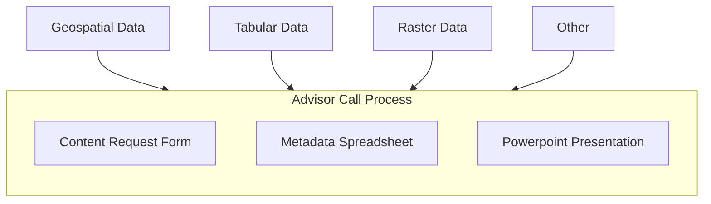

# Data/Metadata EDW Integration Process

```mermaid
flowchart TD
    A[Geospatial Data]
    B[Tabular Data]
    C[Raster Data]
    D[Other]

    A --> Advisor_Call_Process
    B --> Advisor_Call_Process
    C --> Advisor_Call_Process
    D --> Advisor_Call_Process

    subgraph Advisor_Call_Process [Advisor Call Process]
        direction TB
        P1[Content Request Form]
        P2[Metadata Spreadsheet]
        P3[Powerpoint Presentation]
    end

```