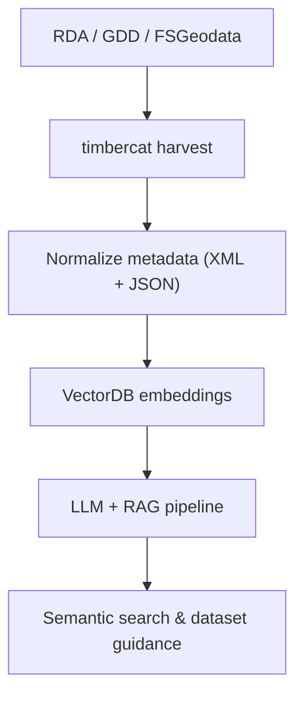

# Catalog

Catalog is a Python CLI that automates discovery and understanding of U.S. Forest Service geospatial data. It harvests XML metadata and MapServer service definitions from three portals, builds embeddings, and lets you explore datasets with a semantic, RAG-powered search so you can answer questions like “what data exists and how do I use it?” without manual spelunking.

## Why it matters

- Hunting across portals, downloading XML one-by-one, and reconciling service URLs slows research and product teams.
- Explaining lineage and “fit for purpose” to stakeholders is hard without a unified view.
- Traditional keyword search misses nuance; semantic search with LLMs surfaces relevant datasets faster.

## What Catalog does

- Automated harvesting from RDA, GDD, and FSGeodata (XML + MapServer JSON).
- Embeds metadata with ChromaDB and uses LLMs in a Retrieval-Augmented Generation (RAG) flow for semantic Q&A.
- Python [Click](https://click.palletsprojects.com/en/stable/)-based CLI (`timbercat`) to harvest, inspect, and query datasets.
- Outputs organized metadata and service URLs you can plug into dashboards or analyses.

## The process (at a glance)

1. Identify metadata sources:  
   - Forest Service Research Data Archive (RDA): research-grade datasets from FS R&D and JFSP.  
   - Geospatial Data Discovery (GDD): current operational GIS layers and services.  
   - Forest Service Geospatial Data Clearinghouse (FSGeodata): authoritative basemaps, boundaries, roads/trails, and raster products.

2. Harvest metadata: `timbercat harvest` pulls XML and MapServer JSON, normalizes fields, and stores them for indexing.

3. Build the vector database: embeddings go into vector storage; metadata stays linked for provenance.

4. RAG-based search: the CLI uses the embeddings plus an LLM to answer dataset and lineage questions with grounded citations.

## Where to go next

- Architecture and design decisions: see `docs/architecture.md`.
- Data sources deep dive: see `docs/data-sources.md`.
- CLI usage and examples: see `docs/cli.md`.
- Vector DB details and comparisons: see `docs/vector-db.md`.
