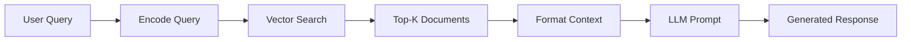

# LLM Integration

## Overview

The `llm.py` module implements the Large Language Model (LLM) integration layer for the Catalog application. It provides a Retrieval-Augmented Generation (RAG) system that combines vector database search with AI-powered natural language responses. The module uses the OpenAI client library configured to work with the ESIIL LLM API infrastructure.

**Key Features:**

- RAG-based question answering
- Vector similarity search for document retrieval
- Context-aware response generation
- Support for multiple LLM models
- Integration with sentence transformers for query embedding

## Architecture

The LLM integration follows a RAG (Retrieval-Augmented Generation) pattern:

```
User Query → Embed Query → Vector Search → Retrieve Documents →
Build Context → LLM Generation → Response
```

## ChatBot Class

The `ChatBot` class (src/llm.py) is the main interface for interacting with the LLM system.

### Initialization

```python
chatbot = ChatBot()
```

**Implementation Details (src/llm.py):**

- Initializes OpenAI client with ESIIL API configuration
- Sets model from `ESIIL_MODEL` environment variable or defaults to `"Llama-3.2-11B-Vision-Instruct"`
- Falls back to dummy credentials if environment variables are not set

**Code:**

```python
def __init__(self):
    """Initialize the ChatBot with ESIIL LLM configuration"""
    self.client = OpenAI(
        api_key=ESIIL_API_KEY or "dummy-key",
        base_url=ESIIL_API_URL or "https://llm-api.cyverse.ai/v1",
    )
    self.model = ESIIL_MODEL
```

## Methods

### get_documents()

Retrieves relevant documents from the vector database based on a query string.

**Signature:**

```python
def get_documents(self, query: str) -> str
```

**Parameters:**

- `query` (str): The search query string

**Returns:**

- List of document dictionaries matching the query, or empty list if no results

**Implementation (src/llm.py):**

1. Encodes the query using `all-MiniLM-L6-v2` sentence transformer (same model used for document embeddings)
2. Converts embedding to list format
3. Calls `search_docs()` from `src/db.py` with the query embedding
4. Returns matching documents ranked by similarity

**Code:**

```python
def get_documents(self, query: str) -> str:
    """
    Placeholder for RAG query method
    """
    encoder = SentenceTransformer("all-MiniLM-L6-v2")
    query_embedding = encoder.encode(query).tolist()

    if len(query_embedding) > 0:  # Should have embedding dimensions
        documents = search_docs(query_embedding)
        return documents
    else:
        return []
```

**Document Structure:**

Each returned document contains:

```python
{
    'id': int,
    'title': str,
    'description': str,
    'keywords': List[str],
    'similarity_score': float
}
```

### chat()

Sends a message to the LLM and returns an AI-generated response using retrieved documents as context.

**Signature:**

```python
def chat(self, message: str = "Hello, how can you help me?") -> str
```

**Parameters:**

- `message` (str): The user's question or message. Default: `"Hello, how can you help me?"`

**Returns:**

- String containing the LLM's response

**Implementation (src/llm.py):**

1. **Retrieve Documents**: Calls `get_documents()` with the user's message
2. **Build Context**: Constructs formatted context from retrieved documents
3. **LLM Request**: Sends context and question to the LLM via OpenAI-compatible API
4. **Return Response**: Extracts and returns the generated text

**Context Format:**

```text
Title: {title}
Description: {description}
Keywords: {keywords}

Title: {title}
Description: {description}
Keywords: {keywords}
...
```

**System Prompt:**

```text
You are a helpful assistant. Use the provided context to answer questions.
```

**User Prompt Template:**

```text
Context: {context}

Question: {message}
```

**Code:**

```python
def chat(self, message: str = "Hello, how can you help me?") -> str:
    documents = self.get_documents(message)
    if len(documents) > 0:
        context = "\n\n".join([
            f"Title: {doc['title']}\nDescription: {doc['description']}\nKeywords: {doc['keywords']}"
            for doc in documents
        ])

        response = self.client.chat.completions.create(
            model="Llama-3.2-11B-Vision-Instruct",
            messages=[
                {
                    "role": "system",
                    "content": "You are a helpful assistant. Use the provided context to answer questions.",
                },
                {
                    "role": "user",
                    "content": f"Context: {context}\n\nQuestion: {message}",
                },
            ],
        )
        return response.choices[0].message.content
```

## RAG Implementation

### Retrieval-Augmented Generation Flow

The RAG system enhances LLM responses by providing relevant context from the vector database:



### Why RAG?

1. **Grounded Responses**: Answers are based on actual catalog data, not just pre-trained knowledge
2. **Reduced Hallucination**: Context provides factual grounding for responses
3. **Domain Specificity**: Enables accurate responses about USFS datasets without fine-tuning
4. **Transparency**: Retrieved documents can be shown to users for verification

### Embedding Consistency

**Critical**: Both document storage and query encoding use the same model:

- **Model**: `all-MiniLM-L6-v2`
- **Dimensions**: 384
- **Why**: Ensures query and document embeddings are in the same vector space for accurate similarity matching

## Model Selection

The current implementation hardcodes `"Llama-3.2-11B-Vision-Instruct"` in the `chat()` method. The model can be configured via the `ESIIL_MODEL` environment variable (used in `__init__`), but the chat method currently overrides this. The code includes comments documenting other models that were tested:

### Tested Models

| Model | Notes | Status |
|-------|-------|--------|
| `Llama-3.2-11B-Vision-Instruct` | Slow performance | **Current (hardcoded)** |
| `Llama-3.3-70B-Instruct-quantized` | Slightly faster than 11B | Commented option |

The code currently includes commented references to these two models with performance notes.

### Changing Models

To use a different model, modify the code in `src/llm.py` or set the `ESIIL_MODEL` environment variable:

#### Option 1: Update code

```python
model="your-preferred-model"
```

#### Option 2: Set environment variable

```bash
export ESIIL_MODEL="your-preferred-model"
```

Note: The hardcoded model in `chat()` currently overrides the environment variable setting.

## Usage Examples

### Basic Chat

```python
from catalog.llm import ChatBot

# Initialize chatbot
bot = ChatBot()

# Send a query
response = bot.chat("What datasets are available about wildfires?")
print(response)
```

### Document Retrieval Only

```python
from catalog.llm import ChatBot

bot = ChatBot()

# Get relevant documents without LLM generation
documents = bot.get_documents("forest management")

for doc in documents:
    print(f"Title: {doc['title']}")
    print(f"Similarity: {doc['similarity_score']:.4f}")
    print()
```

### Custom Query with Context

```python
from catalog.llm import ChatBot

bot = ChatBot()

query = "What data is available for climate change research in national forests?"
response = bot.chat(query)

print(f"Query: {query}")
print(f"Response: {response}")
```

## Integration Points

### API Integration

The ChatBot is used in `src/api.py` for the `/query` endpoint:

```python
@api.get("/query", tags=["Query"])
async def query(q: str):
    bot = ChatBot()
    response = bot.chat(q)
    return {"query": q, "response": response}
```

### Database Integration

The `get_documents()` method calls `search_docs()` from `src/db.py`:

- **Function**: `search_docs(query_embedding, limit=10)`
- **Location**: `src/db.py`
- **Returns**: Top-K similar documents using cosine distance

## Performance Considerations

### Query Embedding

- **Model Loading**: `SentenceTransformer` model is loaded for each query
- **Optimization**: Consider caching the model instance for repeated queries

### Document Retrieval

- **Default Limit**: `search_docs()` returns top 10 documents by default
- **Performance**: Vector search performance depends on database indexing (HNSW or IVFFlat)

### LLM Inference

- **Speed**: Varies significantly by model (see Model Selection table)
- **Context Size**: More documents = larger context = slower inference
- **Trade-off**: Balance retrieval quality vs. response time

## Error Handling

### No Documents Found

If `get_documents()` returns an empty list, the `chat()` method returns `None` (implicit behavior when the `if` condition fails).

**Recommended Enhancement:**

```python
def chat(self, message: str = "Hello, how can you help me?") -> str:
    documents = self.get_documents(message)
    if len(documents) > 0:
        # ... existing logic
    else:
        return "I couldn't find any relevant documents for your query."
```

### API Connection Issues

- Falls back to dummy credentials if environment variables are missing
- May result in authentication errors at runtime
- Ensure proper configuration before deployment

## Future Enhancements

Potential improvements to consider:

1. **Model Caching**: Cache the sentence transformer model to avoid repeated loading
2. **Streaming Responses**: Implement streaming for long-form answers
3. **Conversation Memory**: Add conversation history for multi-turn dialogues
4. **Configurable Retrieval**: Allow users to specify number of documents to retrieve
5. **Hybrid Search**: Combine vector search with keyword search for better retrieval
6. **Response Citations**: Include source document references in responses
7. **Query Refinement**: Implement query expansion or refinement strategies
8. **Model Selection API**: Allow runtime model selection via parameters
9. **Fallback Handling**: Better error handling when no documents are found
10. **Metrics and Logging**: Track query performance and relevance metrics

## Dependencies

- `openai`: OpenAI client library (used for ESIIL API)
- `sentence-transformers`: For query embedding generation
- `dotenv`: Environment variable management
- `src/db.search_docs`: Vector database search function

## Code Location

All LLM functionality is implemented in:

- **File**: `src/llm.py`
- **Class**: `ChatBot`
